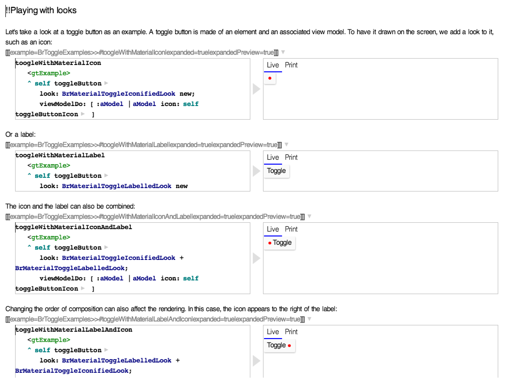
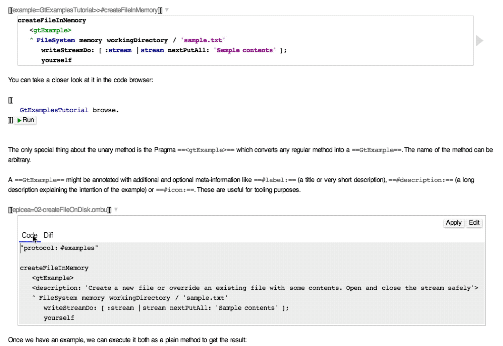
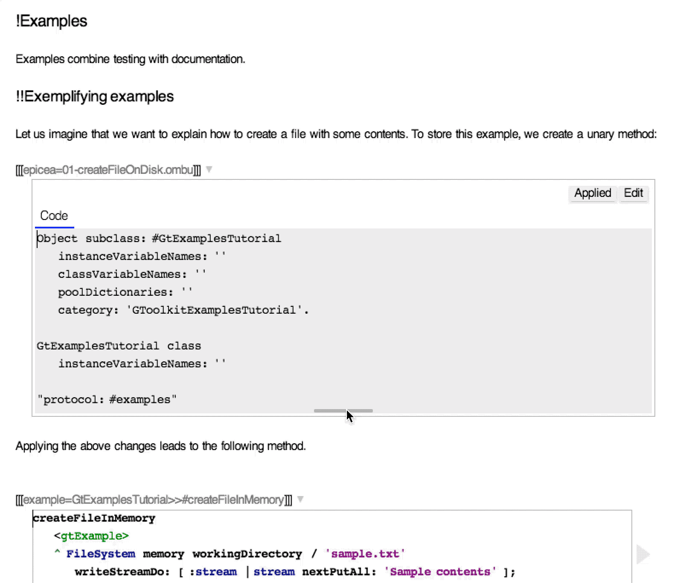
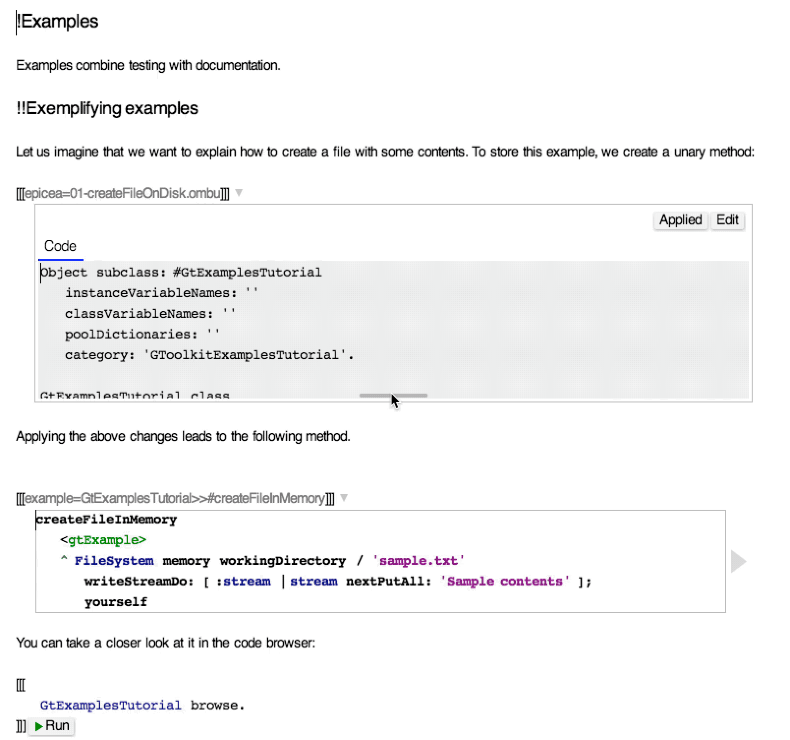
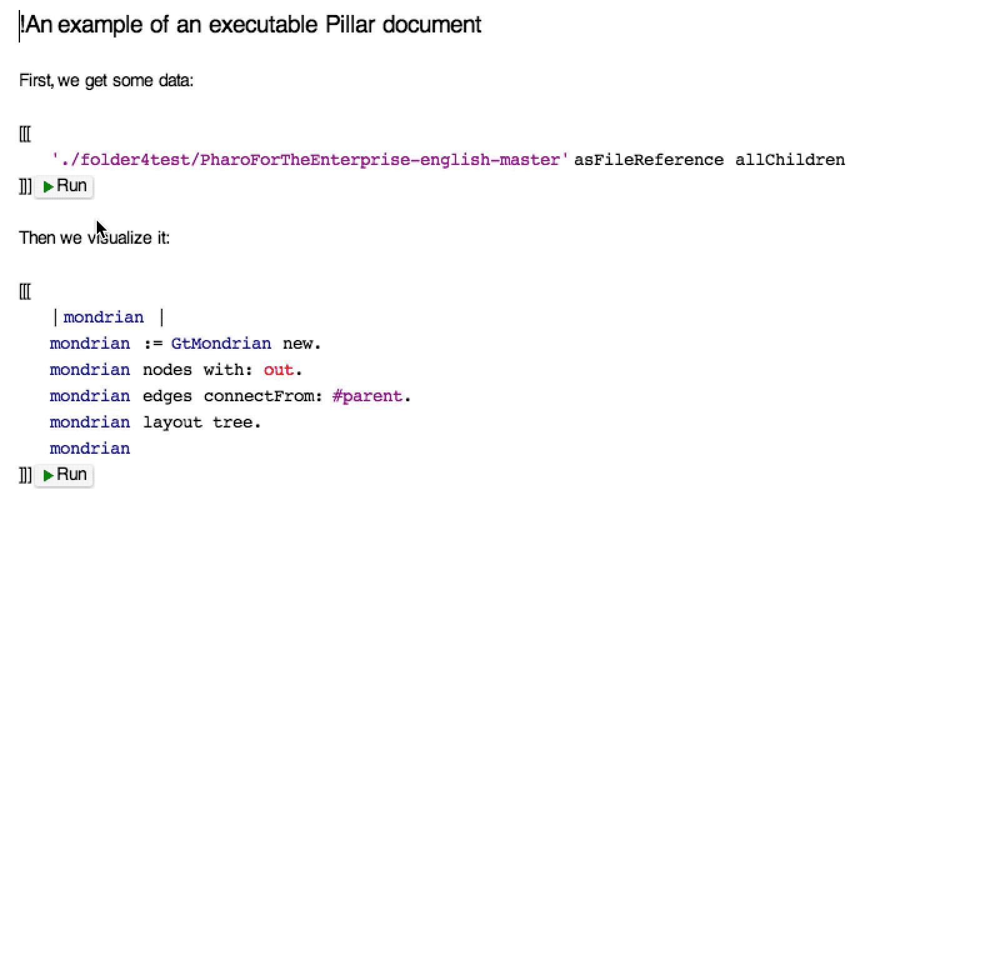

 # GT Documenter
Documenter is the tool for creating and consuming live documents directly in the development environment.

It was part of [Glamorous Toolkit](https://github.com/feenkcom/gtoolkit). It was replaced by [Lepiter](https://github.com/feenkcom/lepiter).

It exploits the [Bloc project](https://github.com/pharo-graphics/Bloc) for rendering, and the [Pillar project](https://github.com/pillar-markup/pillar) for the markup language.

At its core it offers a live editor for manipulating Pillar documents. The interaction happens seamlessly directly in the text editor, and it can be combined with different types of previews to serve several classes of use cases:
- documentation of existing code
- tutorials
- interactive data notebook

## Documentation of existing code

Documenter complements the [Glamorous Toolkit examples engine](https://github.com/feenkcom/gtoolkit-examples) to redefine code documentation. When practicing example-driven development, examples get written as part of the typical development. Once examples exist, they can be quickly put together in a document to form documentation. For example, the picture below shows the comment of a class containing a visual explanation:



You can see a live example of documentation by inspecting the following snippet:
```
GtDocumenter editorForText: BrToggleExamples comment. 
```

## Tutorials

Documenter offers a new experience of writing tutorials for Pharo by enabling the creation and embedding of Epicea change sessions directly in the document. For example, take a look at the following animation:




The document shows a method on top, and a change preview at the bottom showing both the code and the associated diff to the state from the image. Applying the change updates both the change view (no more diff), and method preview. This speeds up the process of going through a tutorial faster. Furthermore, given that now the document shows the diff to the current image, the reader can safely explore alternative scenario and come back to the tutorial at any time without losing the overview.

By default, the code is shown in a scrollable preview. For convenience, the size of the preview can be adjusted at read time:



Or the whole can be expanded:




To explore a concrete tutorial example, inspect the following:

```
IceRepository repositoriesLocation / 'feenkcom'/ 'gtoolkit-examples' / 'doc' / 'tutorial' / 'examples-tutorial.pillar'. 
```
Note - If using Pharo 7 or a newer version of Iceberg, use the following instead:

```
IceLibgitRepository repositoriesLocation / 'feenkcom'/ 'gtoolkit-examples' / 'doc' / 'tutorial' / 'examples-tutorial.pillar'. 
```

## Interactive data notebook

A Documenter document can also be used as an interactive notebook. Internally it essentially acts as a playground:
- it supports defining variables in code snippets, and
- the execution of code shows an embedded inspector.

For example:




Furthermore, to make the manipulation of results more efficient, we can also resize the preview:


## How to load

The ideal way to load the code is by loading the entire [Glamorous Toolkit project](https://github.com/feenkcom/gtoolkit).
